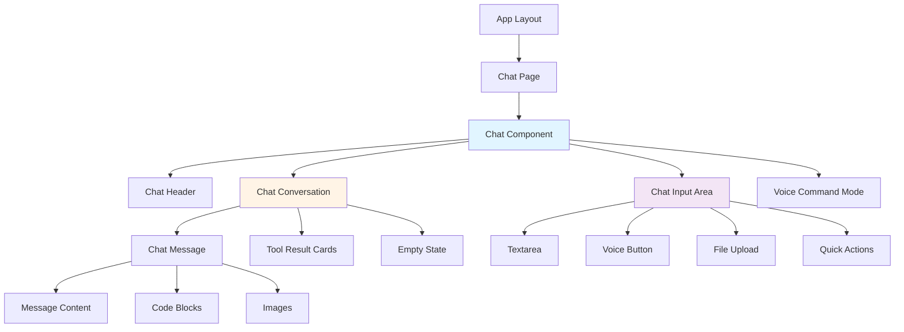
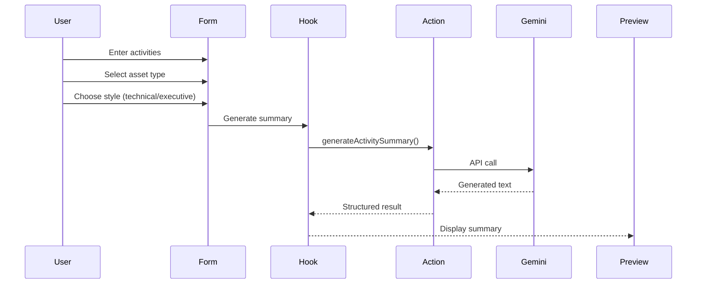

## Component Hierarchy

The GIMA AI Chatbot uses a layered component architecture with clear separation of concerns.



## Component Layers

### Layer 1: UI Primitives (`components/ui/`)

Base components built on Radix UI. These are unstyled, accessible, and reusable.

<Tabs>
  <Tab title="Overview">
    **Characteristics:**
    - Based on Radix UI primitives
    - Styled with Tailwind CSS
    - Fully accessible (ARIA)
    - Keyboard navigable
    - Theme-aware (dark/light mode)
    
    **Examples:**
    - Button, Card, Dialog
    - Input, Select, Textarea
    - Toast, Tooltip, Progress
  </Tab>
  
  <Tab title="Button Component">
    ```tsx components/ui/button.tsx
    import { Slot } from '@radix-ui/react-slot';
    import { cva, type VariantProps } from 'class-variance-authority';
    
    const buttonVariants = cva(
      'inline-flex items-center justify-center rounded-md transition-colors',
      {
        variants: {
          variant: {
            default: 'bg-primary text-primary-foreground hover:bg-primary/90',
            destructive: 'bg-destructive text-destructive-foreground',
            outline: 'border border-input bg-background hover:bg-accent',
            ghost: 'hover:bg-accent hover:text-accent-foreground',
          },
          size: {
            default: 'h-10 px-4 py-2',
            sm: 'h-9 rounded-md px-3',
            lg: 'h-11 rounded-md px-8',
            icon: 'h-10 w-10',
          },
        },
        defaultVariants: {
          variant: 'default',
          size: 'default',
        },
      }
    );
    
    export interface ButtonProps
      extends React.ButtonHTMLAttributes<HTMLButtonElement>,
        VariantProps<typeof buttonVariants> {
      asChild?: boolean;
    }
    
    export function Button({ className, variant, size, asChild, ...props }: ButtonProps) {
      const Comp = asChild ? Slot : 'button';
      return <Comp className={cn(buttonVariants({ variant, size, className }))} {...props} />;
    }
    ```
    
    **Usage:**
    ```tsx
    <Button variant="default">Click me</Button>
    <Button variant="outline" size="sm">Small</Button>
    <Button variant="destructive">Delete</Button>
    ```
  </Tab>
  
  <Tab title="Card Component">
    ```tsx components/ui/card.tsx
    export function Card({ className, ...props }: React.HTMLAttributes<HTMLDivElement>) {
      return (
        <div
          className={cn(
            'rounded-lg border bg-card text-card-foreground shadow-sm',
            className
          )}
          {...props}
        />
      );
    }
    
    export function CardHeader({ className, ...props }) {
      return <div className={cn('flex flex-col space-y-1.5 p-6', className)} {...props} />;
    }
    
    export function CardTitle({ className, ...props }) {
      return <h3 className={cn('text-2xl font-semibold', className)} {...props} />;
    }
    
    export function CardContent({ className, ...props }) {
      return <div className={cn('p-6 pt-0', className)} {...props} />;
    }
    ```
  </Tab>
</Tabs>

### Layer 2: AI Elements (`components/ai-elements/`)

Specialized components for AI interactions, adapted from Vercel AI SDK ecosystem.

<AccordionGroup>
  <Accordion title="Message Display" icon="message-square">
    **`message.tsx`** - Renders chat messages with rich content
    
    **Features:**
    - Markdown rendering with syntax highlighting
    - Code block display with copy functionality
    - Image and file attachment support
    - User/assistant differentiation
    - Timestamp and metadata
    
    **Props:**
    ```typescript
    interface MessageProps {
      role: 'user' | 'assistant' | 'system';
      content: string | React.ReactNode;
      timestamp?: Date;
      attachments?: Attachment[];
      isStreaming?: boolean;
    }
    ```
  </Accordion>
  
  <Accordion title="Code Blocks" icon="code">
    **`code-block.tsx`** - Syntax-highlighted code display
    
    **Features:**
    - Syntax highlighting with Shiki
    - Language detection
    - Copy to clipboard
    - Line numbers
    - Theme-aware colors
    
    **Example:**
    ```tsx
    <CodeBlock
      language="typescript"
      code={`const greeting = "Hello, GIMA!";`}
      showLineNumbers
    />
    ```
  </Accordion>
  
  <Accordion title="Tool Results" icon="wrench">
    **`tool.tsx`** - Displays AI tool execution results
    
    **Features:**
    - Loading states during execution
    - Success/error indicators
    - Structured data display
    - Expandable details
    
    **Used by chat-tools.ts:**
    - Asset query results
    - Maintenance order lists
    - Inventory searches
    - Calendar views
  </Accordion>
  
  <Accordion title="Other Elements" icon="sparkles">
    - **`artifact.tsx`**: Display generated artifacts
    - **`reasoning.tsx`**: Show AI reasoning process
    - **`loader.tsx`**: Loading animations
    - **`suggestion.tsx`**: AI suggestions
    - **`sources.tsx`**: Source citations
    - **`confirmation.tsx`**: User confirmation prompts
  </Accordion>
</AccordionGroup>

### Layer 3: Feature Components (`components/features/`)

Domain-specific components with business logic.

## Main Features

### Chat Feature (`features/chat/`)

The core chat interface with multi-modal capabilities.

#### Component Structure

```
features/chat/
├── chat.tsx                      # Main orchestrator
├── chat-conversation.tsx         # Message list with virtualization
├── chat-header.tsx               # Title, theme toggle, clear button
├── chat-input-area.tsx           # Input controls and quick actions
├── chat-message.tsx              # Individual message renderer
├── chat-empty-state.tsx          # Welcome screen
├── chat-quick-actions.tsx        # Predefined prompts
├── chat-status-bar.tsx           # Status indicators
├── chat-message-skeleton.tsx     # Loading skeleton
├── cards/                        # Result card components
│   ├── checklist-result-card.tsx
│   └── summary-result-card.tsx
├── hooks/                        # Chat-specific hooks
│   ├── use-chat-actions.ts      # Regenerate, copy, clear
│   ├── use-chat-keyboard.ts     # Keyboard shortcuts
│   ├── use-chat-submit.ts       # Submit handling
│   ├── use-file-submission.ts   # File upload logic
│   └── use-image-analysis.ts    # Image analysis trigger
├── types/                        # Type definitions
└── utils.ts                      # Helper functions
```

#### Chat Component (`chat.tsx`)

**Responsibilities:**

1. **State Management**
   - Message history with `usePersistentChat`
   - Voice recording state
   - File upload state
   - Command mode state

2. **Event Orchestration**
   - User input submission
   - Voice command detection
   - Quick action execution
   - Tool approval handling

3. **Integration Points**
   - AI streaming responses
   - Backend API calls via tools
   - File upload (images, PDFs)
   - Voice transcription

**Key Code Sections:**

<CodeGroup>
```tsx Persistent Chat Hook
// app/components/features/chat/chat.tsx:74
const {
  messages,
  sendMessage,
  status,
  reload,
  error: chatError,
  clearHistory,
  setMessages,
  addToolOutput,
} = usePersistentChat();
```

```tsx Voice Input Integration
// app/components/features/chat/chat.tsx:103
const {
  isListening,
  isProcessing,
  isSupported,
  mode,
  transcript,
  toggleListening,
  error: voiceError,
} = useVoiceInput({ onTranscript: updateTextareaValue });
```

```tsx File Submission Handler
// app/components/features/chat/chat.tsx:114
const { handleSubmit, isAnalyzing, analyzingFileType } = useFileSubmission({
  setMessages,
  sendMessage,
  isListening,
  toggleListening,
});
```
</CodeGroup>

#### Chat Input Area (`chat-input-area.tsx`)

**Features:**

- Auto-resizing textarea
- File upload (images, PDFs)
- Voice recording button
- Send button with loading state
- Quick action suggestions
- Character count (optional)

**Component Props:**

```typescript
interface ChatInputAreaProps {
  textareaRef: React.RefObject<HTMLTextAreaElement>;
  input: string;
  onInputChange: (e: React.ChangeEvent<HTMLTextAreaElement>) => void;
  onSubmit: (data: { text: string; files: File[] }) => void;
  canSend: boolean;
  status: ChatStatus;
  isAnalyzingFile: boolean;
  onQuickAction: (prompt: string) => void;
  voiceProps: VoiceButtonProps;
}
```

#### Chat Message (`chat-message.tsx`)

**Rendering Logic:**

1. **Role-based styling**: User messages on right, assistant on left
2. **Content type detection**: Text, code, images, tool results
3. **Markdown processing**: Using `react-markdown`
4. **Action buttons**: Copy, regenerate, delete

**Example Structure:**

```tsx
<div className={cn('flex gap-3', message.role === 'user' ? 'justify-end' : 'justify-start')}>
  {message.role === 'assistant' && <Avatar>AI</Avatar>}
  
  <div className={cn('rounded-lg p-3', roleClasses)}>
    <MessageContent content={message.content} />
    <MessageActions onCopy={handleCopy} onRegenerate={handleRegenerate} />
  </div>
  
  {message.role === 'user' && <Avatar>U</Avatar>}
</div>
```

### AI Tools Feature (`features/ai-tools/`)

Standalone AI-powered tools for maintenance tasks.

#### Activity Summary Tool

**Location:** `features/ai-tools/activity-summary/`

**Purpose:** Generate professional summaries of maintenance activities.

**Components:**
- `activity-summary.tsx`: Main container
- `activity-summary-form.tsx`: Input form
- `activity-summary-preview.tsx`: Result display
- `activity-summary-list.tsx`: History list

**Flow:**



#### Checklist Builder Tool

**Location:** `features/ai-tools/checklist-builder/`

**Purpose:** Generate maintenance checklists tailored to equipment types.

**Generated Checklist Structure:**

```typescript
interface GeneratedChecklist {
  title: string;
  description: string;
  items: ChecklistItem[];
  estimatedDuration: string;
  requiredTools: string[];
  safetyNotes: string[];
}

interface ChecklistItem {
  step: number;
  task: string;
  category: 'inspection' | 'cleaning' | 'lubrication' | 'testing' | 'documentation';
  critical: boolean;
}
```

**Example Output:**

<Accordion title="Sample HVAC Preventive Maintenance Checklist">
```json
{
  "title": "Mantenimiento Preventivo - Unidad HVAC",
  "description": "Checklist trimestral para unidades manejadoras de aire",
  "estimatedDuration": "2-3 horas",
  "items": [
    {
      "step": 1,
      "task": "Verificar presión del sistema (12-15 PSI)",
      "category": "inspection",
      "critical": true
    },
    {
      "step": 2,
      "task": "Limpiar filtros de aire",
      "category": "cleaning",
      "critical": true
    },
    {
      "step": 3,
      "task": "Lubricar motores de ventiladores",
      "category": "lubrication",
      "critical": false
    }
  ],
  "requiredTools": ["Manómetro", "Destornilladores", "Aceite lubricante"],
  "safetyNotes": ["Desconectar alimentación eléctrica antes de iniciar"]
}
```
</Accordion>

### Voice Feature (`features/voice/`)

Dual-mode voice system for dictation and commands.

#### Architecture

**Two Voice Modes:**

1. **Dictation Mode** (Default)
   - Transcribes speech to text in input box
   - Uses Gemini API or Web Speech API
   - Low friction for general chat
   - Auto-detects high-confidence commands

2. **Command Mode** (Explicit)
   - Dedicated UI for work order creation
   - Parses structured commands
   - Requires user confirmation
   - Higher confidence threshold (0.7+)

**Components:**

```
voice/
├── voice-button.tsx              # Recording toggle button
├── voice-command-mode.tsx        # Command-specific UI
├── audio-waveform.tsx            # Visual feedback
├── command-preview.tsx           # Command confirmation
├── command-status-indicator.tsx  # Status display
└── hooks/
    ├── use-voice-system.ts      # Core voice logic
    ├── use-voice-command-flow.ts # Command state machine
    └── use-voice-navigation.ts   # Keyboard shortcuts
```

#### Voice Button Component

**States:**

- **Idle**: Ready to record
- **Listening**: Recording audio (red pulse)
- **Processing**: Transcribing (spinner)
- **Error**: Failed (error icon)

**Visual Feedback:**

```tsx
<button
  onClick={toggleListening}
  className={cn(
    'rounded-full p-3 transition-colors',
    isListening && 'animate-pulse bg-red-500',
    isProcessing && 'bg-yellow-500',
    !isListening && !isProcessing && 'bg-blue-500 hover:bg-blue-600'
  )}
>
  {isListening ? <MicIcon /> : isProcessing ? <LoaderIcon /> : <MicOffIcon />}
</button>
```

### Theme Feature (`features/theme/`)

Dark/light mode toggle with system preference detection.

**Implementation:**

- Uses `next-themes` for theme management
- Persists preference in localStorage
- Supports system preference
- No flash on page load (SSR compatible)

## Component Patterns

### Pattern 1: Compound Components

Components that work together as a cohesive unit.

```tsx
// Card compound component
<Card>
  <CardHeader>
    <CardTitle>Title</CardTitle>
    <CardDescription>Description</CardDescription>
  </CardHeader>
  <CardContent>
    Content here
  </CardContent>
  <CardFooter>
    <Button>Action</Button>
  </CardFooter>
</Card>
```

### Pattern 2: Render Props

Components that accept functions as children for flexible rendering.

```tsx
<DataTable
  data={items}
  renderRow={(item) => (
    <TableRow key={item.id}>
      <TableCell>{item.name}</TableCell>
    </TableRow>
  )}
/>
```

### Pattern 3: Custom Hooks

Extract component logic into reusable hooks.

```tsx
// In component
function ChatInput() {
  const { input, setInput, handleSubmit } = useChatSubmit();
  const { isListening, toggleListening } = useVoiceInput();
  
  return (
    <form onSubmit={handleSubmit}>
      <input value={input} onChange={(e) => setInput(e.target.value)} />
      <button onClick={toggleListening}>Voice</button>
    </form>
  );
}
```

### Pattern 4: Error Boundaries

Graceful error handling at component boundaries.

```tsx
// app/components/shared/error-boundary.tsx
export class ErrorBoundary extends React.Component {
  componentDidCatch(error: Error) {
    logger.error('Component error', error);
  }
  
  render() {
    if (this.state.hasError) {
      return <ErrorFallback />;
    }
    return this.props.children;
  }
}
```

## Styling Approach

### Tailwind CSS Utility-First

**Benefits:**
- No CSS file management
- Consistent spacing/colors
- Responsive by default
- Dark mode built-in

**Example:**

```tsx
<div className="flex flex-col gap-4 p-6 bg-white dark:bg-gray-900 rounded-lg shadow-md">
  <h2 className="text-2xl font-bold text-gray-900 dark:text-white">
    Title
  </h2>
  <p className="text-gray-600 dark:text-gray-400">
    Description
  </p>
</div>
```

### CSS Variables for Theming

**Defined in `globals.css`:**

```css
:root {
  --background: 0 0% 100%;
  --foreground: 222.2 84% 4.9%;
  --primary: 221.2 83.2% 53.3%;
  --primary-foreground: 210 40% 98%;
  /* ... */
}

.dark {
  --background: 222.2 84% 4.9%;
  --foreground: 210 40% 98%;
  /* ... */
}
```

**Usage:**

```tsx
<div className="bg-background text-foreground">
  <button className="bg-primary text-primary-foreground">
    Themed Button
  </button>
</div>
```

## Testing Components

### Unit Tests with Vitest

**Example Test:**

```tsx
import { render, screen } from '@testing-library/react';
import { Button } from '@/app/components/ui/button';

test('renders button with text', () => {
  render(<Button>Click me</Button>);
  expect(screen.getByText('Click me')).toBeInTheDocument();
});

test('calls onClick when clicked', async () => {
  const onClick = vi.fn();
  render(<Button onClick={onClick}>Click</Button>);
  await userEvent.click(screen.getByText('Click'));
  expect(onClick).toHaveBeenCalledOnce();
});
```

### Integration Tests

**Testing chat flow:**

```tsx
test('sends message and receives response', async () => {
  render(<Chat />);
  
  const input = screen.getByRole('textbox');
  await userEvent.type(input, 'Hello');
  
  const sendButton = screen.getByRole('button', { name: /send/i });
  await userEvent.click(sendButton);
  
  expect(await screen.findByText(/Hola/i)).toBeInTheDocument();
});
```

## Best Practices

<CardGroup cols={2}>
  <Card title="Composition" icon="boxes-stacked">
    Prefer composition over inheritance. Build complex UIs from simple components.
  </Card>
  
  <Card title="Single Responsibility" icon="bullseye">
    Each component should do one thing well. Split large components into smaller ones.
  </Card>
  
  <Card title="Type Safety" icon="shield">
    Define explicit prop types. Use TypeScript discriminated unions for variants.
  </Card>
  
  <Card title="Accessibility" icon="universal-access">
    Use semantic HTML. Add ARIA labels. Test keyboard navigation.
  </Card>
</CardGroup>

## Next Steps

<CardGroup cols={2}>
  <Card title="Development Setup" icon="code" href="/development/setup">
    Get started with local development
  </Card>
  
  <Card title="API Reference" icon="book" href="/api-reference/chat">
    Explore the API documentation
  </Card>
</CardGroup>
