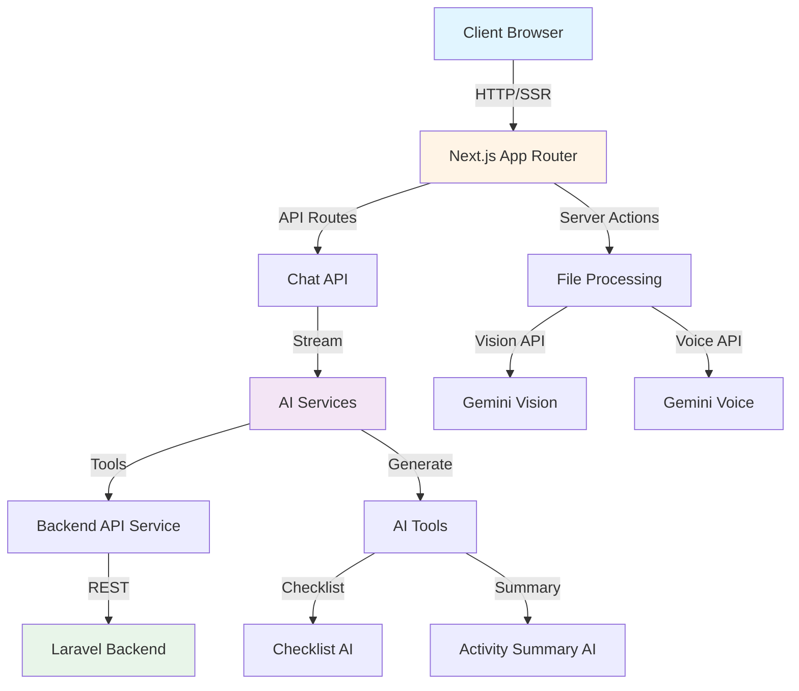
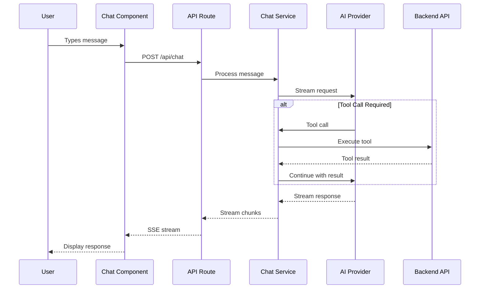

## System Architecture

The GIMA AI Chatbot is a Next.js 16 application built with modern web technologies and AI integrations. It follows a server-client architecture optimized for real-time AI interactions while maintaining excellent developer experience and type safety.

## Core Technologies

<CardGroup cols={2}>
  <Card title="Framework" icon="react">
    - **Next.js 16** with App Router
    - **React 19** with Server Components
    - TypeScript 5 in strict mode
  </Card>
  
  <Card title="AI/ML" icon="brain">
    - **Vercel AI SDK v5** for streaming
    - **GROQ** (Llama 3.3 70B) for chat
    - **Google Gemini** for vision/voice
  </Card>
  
  <Card title="UI/UX" icon="palette">
    - **Tailwind CSS 4** for styling
    - **Radix UI** for accessible components
    - **Lucide React** for icons
  </Card>
  
  <Card title="Validation" icon="shield-check">
    - **Zod** for runtime validation
    - TypeScript for compile-time safety
    - Strict type checking throughout
  </Card>
</CardGroup>

## Architecture Diagram



## Key Design Principles

### 1. Server-First Architecture

The application leverages Next.js Server Components and Server Actions to:
- Keep API keys secure on the server
- Reduce client bundle size
- Enable streaming AI responses
- Handle sensitive operations server-side

### 2. Type Safety

Strict TypeScript configuration with Zod validation ensures:
- Compile-time type checking
- Runtime data validation
- Automatic type inference
- Safe API contracts

### 3. Modular Component Design

Components are organized by feature and responsibility:
- **UI Components**: Reusable design system primitives
- **AI Elements**: Specialized AI interaction components
- **Features**: Domain-specific feature modules
- **Shared**: Cross-cutting concerns

### 4. Progressive Enhancement

The app works without JavaScript but enhances with it:
- Server-side rendering for initial load
- Client-side hydration for interactivity
- Optimistic UI updates
- Graceful fallbacks

## Data Flow

### Chat Message Flow



### Tool Execution Flow

1. **User Input**: User asks a question requiring backend data
2. **AI Decision**: LLM decides to use a tool (e.g., `consultar_activos`)
3. **Tool Execution**: Server executes tool with authenticated API call
4. **Result Processing**: Tool result is validated and normalized
5. **AI Response**: LLM uses tool result to formulate response
6. **UI Rendering**: Client renders result in interactive table

## Security Model

### Authentication

- Laravel Sanctum bearer token authentication
- Token stored in HTTP-only cookies (future enhancement)
- Silent login for session recovery
- Token injection per-request

### API Security

- Rate limiting per IP address
- Input validation with Zod schemas
- Server-side API key management
- CORS configuration for production

### Data Protection

- No sensitive data in client state
- Encrypted transport (HTTPS)
- Sanitized error messages
- Audit logging for tool calls

## Performance Optimizations

### Client-Side

- **Dynamic Imports**: Code splitting for heavy components
- **React Suspense**: Progressive loading of UI
- **localStorage Caching**: Persistent chat history
- **Debounced Inputs**: Optimized user input handling

### Server-Side

- **Streaming Responses**: Real-time AI output
- **Connection Pooling**: Efficient backend API calls
- **Response Caching**: Cached AI tool results
- **Edge Runtime**: Fast cold starts on Vercel

### AI Optimizations

- **Token Limiting**: Max 15 items per tool response
- **Description Truncation**: Reduce context size
- **Step Limiting**: Max 4 tool call steps
- **Schema Optimization**: Minimal JSON schemas

## Deployment Architecture

<Tabs>
  <Tab title="Production">
    ```
    ┌─────────────────┐
    │   Vercel Edge   │
    │   (Frontend)    │
    └────────┬────────┘
             │
             ├──► GROQ API (Chat)
             ├──► Gemini API (Vision/Voice)
             │
             └──► ┌─────────────────┐
                  │ Laravel Backend │
                  │   (GIMA API)    │
                  └────────┬────────┘
                           │
                           └──► MySQL Database
    ```
  </Tab>
  
  <Tab title="Development">
    ```
    ┌─────────────────┐
    │  localhost:3000 │
    │  (Next.js Dev)  │
    └────────┬────────┘
             │
             ├──► GROQ API (Chat)
             ├──► Gemini API (Vision/Voice)
             │
             └──► ┌─────────────────┐
                  │ Laravel Herd    │
                  │ localhost:8000  │
                  └────────┬────────┘
                           │
                           └──► SQLite/MySQL
    ```
  </Tab>
</Tabs>

## Scalability Considerations

### Horizontal Scaling

- Stateless Next.js instances
- Shared session storage (future)
- Load-balanced backend API
- CDN for static assets

### Vertical Scaling

- Efficient memory usage
- Optimized bundle size
- Lazy loading strategies
- Minimal re-renders

## Monitoring & Observability

### Logging

- Structured logging with custom logger
- Component-level log context
- Error tracking with stack traces
- Performance metrics

### Error Handling

- Global error boundaries
- Graceful degradation
- User-friendly error messages
- Automatic retry logic

## Next Steps

<CardGroup cols={2}>
  <Card title="Project Structure" icon="folder-tree" href="/architecture/project-structure">
    Explore the detailed file and folder organization
  </Card>
  
  <Card title="Component Architecture" icon="boxes" href="/architecture/components">
    Learn about the component hierarchy and patterns
  </Card>
  
  <Card title="API Reference" icon="code" href="/api-reference/chat">
    View the complete API documentation
  </Card>
  
  <Card title="AI Tools" icon="wand-sparkles" href="/features/ai-tools">
    Understand the AI tool system
  </Card>
</CardGroup>
